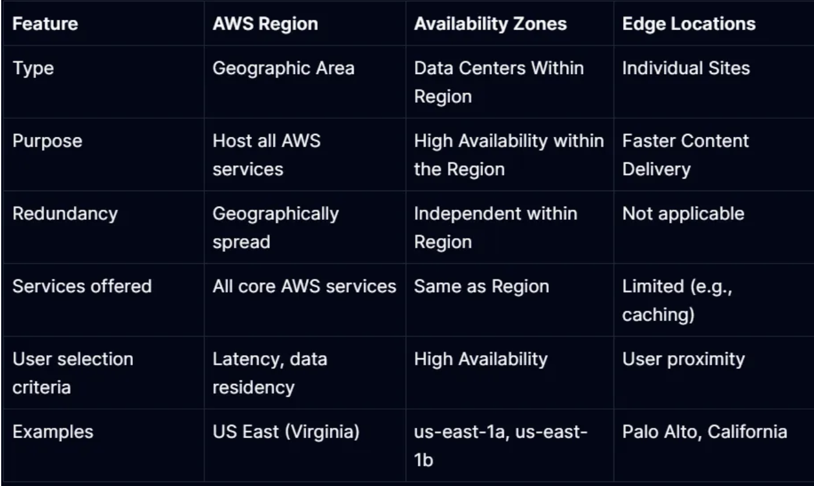

# AWS Interview questions:

1. What are primary services offered by AWS? AWS offer more than 200 services
    1. EC2: virtual servers
    2. S3: 
        - storage service in the cloud. 
        - You can store almost unlimited amount of data. 
        - If you want to store and access them frequently, then AWS charges more. If you want to access less, then they charge less.
    3. IAM
    4. VPC: Virtual private network that you can set up and customize to keep your resources isolated and secure.
    5. route 53: DNS web service
    6. cloudfront: CDN service.
    7. AWS lambda: serverless technology.

2. what is VPC? Explain the steps to set up a secured VPC.
    - Virtual private network
    - It is logically isolated virtual network in aws cloud where you can launch aws resources.
    - Each VPC that you create is logicall isolated from other.
    - It allows you to have full control over your virtual networking environment, including selecting your IP address range, creating subnets, configuring route tables, and setting up network gateways.

    Steps:
    1. Create VPC, enable DNS support and DNS hostnames if needed.
    2. Create Subnets and spread them across availability zones for redundancy.
    3. Configure route tables
    4. Set up NACLs
    5. Implement security groups
    6. Add Internet Gateway
    7. Optional - NAT Gateway/Instance:
    8. Enable Monitoring like VPC flow logs for traffic analysis or monitor with cloud watch.

3. Explain what this IAM policy does
4. How do you secure sensitive information such as API keys, passwords, and other credentials in a CI/CD pipeline on AWS?
5. Name some AWS services which are not region specific:
    - IAM, route 53, AWS cloudfront
6. Describe the key differences between Amazon EC2 and AWS Lambda. When would you choose one over the other for a specific task?
    - EC2 provides virtual servers that you manage
    - AWS Lambda runs code in response to events and scales automatically.
    - Choose EC2 for long-running tasks or when you need more control over the environment. 
    - Choose Lambda for event-driven, short-lived tasks with automatic scaling.
7. In VPC with private and public subnets, database servers should ideally be launched into which subnet?
    - Database servers should ideally be launched into private subnets.
8. How do you choose the right database service in AWS for a specific application’s requirements?
    - **Amazon RDS** is ideal for applications that require a traditional relational database with standard SQL support, transactions, and complex queries.
    - **Amazon DynamoDB** suits applications needing a highly scalable, NoSQL database with fast, predictable performance at any scale. It's great for flexible data models and rapid development.
    - **Amazon Redshift** is best for analytical applications requiring complex queries over large datasets, offering fast query performance by using columnar storage and data warehousing technology.

9. Explain the concept of auto-scaling and how it can be implemented in AWS to handle fluctuating workloads.

10. Explain can you vertically scale an Amazon instance? How?
    - stop the instance
    - change instance type with more resources
    - restart it
11. Can a connection be made between a company’s data center and the Amazon cloud? How?
    - Direct connect: A dedicated, high-bandwidth link for a private connection.
    - VPN: An encrypted connection over the internet for secure data transmission.

12. Explain different AWS services to manage cost
    - AWS budgets:
    - AWS cost and usage report
    - AWS savings plans
    - AWS cost explorer

13. What is the difference between NAT gateways and NAT instances. why do we use them?
    - NAT Gateway: Managed by AWS, high performance, and availability, no administration needed.
    - NAT Instance: User-managed EC2 instance, requires manual scaling and administration, less scalable and available compared to NAT Gateway.

14. What are different ways to access AWS services?
    - AWS management console
    - AWS CLI
    - AWS SDKs
    - AWS cloudformation

15. What are different types of load balancers and when to use them?
    1. Application Load Balancer (ALB): Layer 7
    2. Network Load Balancer (NLB): Layer 4
    3. Gateway Load Balancer (GWLB):

16. What the relationship between an instance and AMI is?
    - Instance: running virtual server
    - AMI(Amazon Machine image) - template used to create instances

17. Your company wants to migrate its on-premises infrastructure to AWS for cost savings and scalability. Outline the steps you would take to plan and execute this migration
    1. Assess the current Infrastructure.
    2. Selecting migration strategy
    3. estimating costs
    4. planning for data migration
    5. Prepare the AWS Environment
    6. testing
    7. executing the migration with minimal downtime
    8. Optimize and Improve After Migration
    9. Training and knowledge transfer
    10. Continuous Monitoring

18. S3 vs EBS vs EFS vs Glacier:
    S3: 
    -   Object storage service designed for storing and retrieving large amounts of unstructure data.
    EBS:
    -   Block level storage volumes that can be attached to EC2 instaces.
    EFS:
    - Scalable file storage service that can be mounted to multiple EC2 instances simultaneously.
    Glacier
    - Low cost archival storage service optimized for long-term retention of infrequently accessed data.

19. What is the difference between stop and terminate in EC2?
    - STOP: all the data and settings are saved. You can start it back up without losing data.
    - Terminate: lose everything and can't bring it back.

20. What is AWS Lambda?
    - Serverless computing service that runs code in response to events.
    - it allows you to run code without provisioning or managing servers.
    - Function as a Service (FaaS)
    - how it works?
        1. Uploade code
        2. Define events
        3. run code
        4. manage resources

21. Use case for cloudFront, cloudWatch, cloudTrail, Cloudformation?
    - CloudFormation: 
        - Service that enables you to define and provision AWS **infrastructure as code** using templates.
        - EX: I want 2 EC2 inside VPC 1 S3 with cloud front. This is a template. If you give this to cloudformation, it will create exactly that.
    - CloudWatch:
    - CloudTrail:
    - CloudFront: CDN

22. what is SNS?
    - simple notification service. Not limited to Push notification.
    - We can send notification by mass.

23. what is difference availability zone, region, and Edge locations?
    

