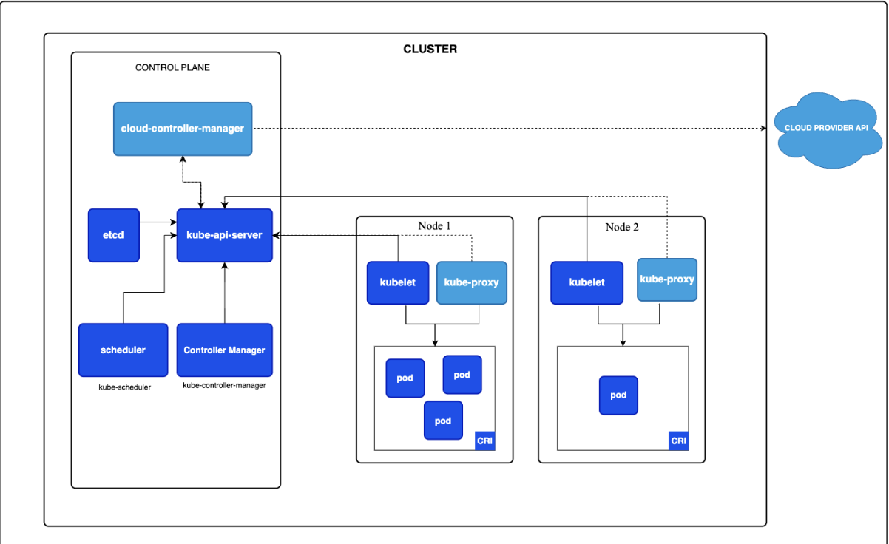

<h1>Introduction to K8s and its architecture</h1>

## what is kubernetes?
- K8s is an open-source platform designed to automate the deployment, scaling, and operation of application containers
- It enables management of containerized application in distributed environments(Physical machines, cloud, VMs, hybrid)

## what problems does k8s solve?
- Container are efficient for running applications, but managing them in production is crucial. This is where k8s comes into picture. 
- Along with providing framework, K8s handles tasks like scaling, failover, load balancing, storage orchestration, automated rollouts/rollbacks, resource optimization, self-healing, secret management, batch execution, horizontal scaling, and extensibility.

## Architecture



- A Kubernetes cluster consists of a control plane plus a set of worker machines, called nodes, that run containerized applications.
- The worker node(s) host the Pods that are the components of the application workload. The control plane manages the worker nodes and the Pods in the cluster. 

### Control Plane components: 
control plane's components make global decisions about the cluster as well as detect and respond to cluster events.

##### ETCD:
- Consistent and highly-available key value store for storing all cluster data.
- It acts as the database for Kubernetes and is critical for maintaining the desired state of the cluster.
- Holds current state of k8s cluster.
- Port: 2379-2380
- Check etcd pod
  ```
  kubectl get pods -n kube-system | grep -i kube-scheduler
  kubectl exec -it <kube-scheduler-pod-id> -- cat /etc/kubernetes/manifests/kube-scheduler.yaml
  ```


##### Schedular:
- watches for newly created Pods with no assigned node, and selects a node for them to run on.
- scheduling decisions include: individual and collective resource requirements, hardware/software/policy constraints, affinity and anti-affinity specifications, data locality, inter-workload interference, and deadlines.
- Port: 10259
- Check kube-scheduler pod
  ```
  kubectl get pods -n kube-system | grep -i etcd
  kubectl exec -it <etcd-pod-id> -- cat /etc/kubernetes/manifests/etcd.yaml
  ```
##### Controller manager:
- The Controller Manager runs different controllers that manage the state of the cluster. In simple words, it keeps track of whats happening in the cluster.

- There are many different types of controllers:
    -   Node controller: 
        -   Responsible for noticing and responding when nodes go down.
    -   Job controller: 
        -   Watches for Job objects that represent one-off tasks, then creates Pods to run those tasks to completion.
    -   EndpointSlice controller: 
        -   Populates EndpointSlice objects (to provide a link between Services and Pods).
    -   ServiceAccount controller: 
        -   Create default ServiceAccounts for new namespaces.
- Port: 10257
- Check kube-controller-manager server pod
  ```
  kubectl get pods -n kube-system | grep -i kube-controller-manager
  kubectl exec -it <kube-controller-manager-pod-id> -- cat /etc/kubernetes/manifests/kube-controller-manager.yaml
  ```


##### Kube API server:
- The API server is the **entry point** for all REST commands used to control the cluster.
- It exposes the Kubernetes API, handling all requests from users, CLI tools, and other components. 
- The API server is the front end for the Kubernetes control plane.
- Port: 6443
- Check kube-api-server pod
  ```
  kubectl get pods -n kube-system | grep -i kube-api-server
  kubectl exec -it <kube-api-server-pod-id> -- cat /etc/kubernetes/manifests/kube-apiserver.yaml

### Node components:
Nodes are the worker machines in the Kubernetes cluster where containers are deployed and run. Each node runs multiple services necessary for running pods and providing the necessary resources.

##### Kubelet 
- The kubelet is an agent that runs on each node
- It is responsible for managing the lifecycle of pods. 
- It communicates with the API server and ensures that containers are running in accordance with the specifications defined in the kubelet configuration.
- Port: 10250
- Check kubelet configuration file and process
  ```
  cat /var/lib/kubelet/config.yaml
  ps -aux | grep kubelet
  ```

##### Kube Proxy 
- kube-proxy maintains network rules on nodes. These network rules allow network communication to your Pods from network sessions inside or outside of your cluster.
- It routes traffic to the appropriate pod based on the service definitions and can handle load balancing.
- Port: 10256
- Check kube-scheduler pod
  ```
  kubectl get daemonset kube-proxy -n kube-system
  kubectl get pods -n kube-system | grep -i kube-proxy
  kubectl exec -it <kube-proxy-pod-id> -- cat /etc/kubernetes/manifests/kube-proxy.yaml
  ```

##### Container Runtime
- This empowers Kubernetes to run containers effectively.  
- It is responsible for managing the execution and lifecycle of containers within the Kubernetes environment.
- It pulls container images from a registry and manages the execution of containers.
- To manage containers running in your Kubernetes cluster
  ```
  crictl ps
  critctl images
  ```

### Addons:

##### DNS
- Provides DNS services for Kubernetes by allowing pods to discover services and resources within the cluster using DNS names.

##### Web UI
- A web-based user interface that allows users to manage and monitor Kubernetes resources easily. It provides visibility into the state of applications running within the cluster.

##### Ingress Controller:
- Manages external access to services, providing HTTP and HTTPS routing to services based on defined rules. 
- It can implement SSL termination and load balancing.


Each component plays a vital role in ensuring the system operates reliably, efficiently, and securely.