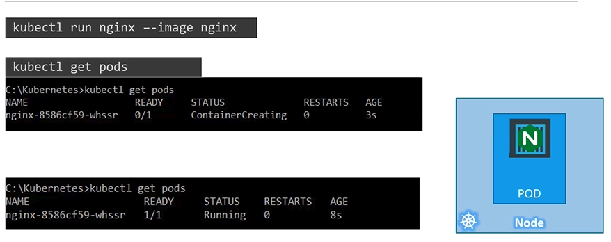

# Pods

With k8s, our ultimate aim is to deploy our application in the form of containers on a set of machines that are configured as worker nodes in a cluster. However, Kubernetes does not deploy containers directly on the worker nodes. The containers are encapsulated into a Kubernetes object known as pods.

In this section, we will take a look at PODS introduction and How to deploy pod?
- Signle instance of appliation.
- Pod is the smallest and simplest unit of deployment.
- It represents a logical host for one or more containers that share the same storage, network resources, and specification on how to run the containers.

## Key features of a POD:
- Shared Networking:
    - All containers in a Pod share the same IP address and network namespace. This means they can communicate with each other using localhost. Each Pod gets its own unique IP address, which allows containers within that Pod to communicate by port numbers.
- Shared Storage:
    - Pods can specify volumes, which can be shared by all containers within the Pod. This promote data sharing and persistent storage needs.
- Lifecycle Management:
    - Pods have phases such as pending, running, succeeded, failed or unkown. K8s manages the state of the pods automatically.

### Types of PODs:
1. single container pods:
    - Mostly used.
2. Multi-container pods:
    - When multiple containers need to work closely together, they can be packaged within the same Pod.

When designing applications in K8s, a key decision is whether to run multiple containers in a single Pod or to deploy multiple Pods for the same application. Use multiple containers within a single Pod when they are tightly coupled, need to share resources, or should be managed as a unit for efficiency. Conversely, opt for multiple Pods for different components of an application that require independent scaling, have varying resource needs, follow different lifecycles, or are built on a microservices architecture.

In summary, pods usually have a one-to-one relationship with containers running your application. To scale up, you create new pods, and to scale down, you delete existing pod. You do not add additional containers to an existing pod to scale your application. Even though Pods have one-to-one relationship with containers, they are not restricted to having a single container in a single pod. A single pod can have multiple containers except for the fact that they're usually not multiple containers of the same kind.

## How Pods Work in Kubernetes?
1. **Creation:** 
    - Pods can be created manually using `kubectl commands` or `defined in YAML/JSON` manifest files.
2. **Deployment:** 
    - Pods are typically managed using higher-level abstractions like Deployments, StatefulSets, or DaemonSets, which automate scaling and management.
3. **Scaling:** 
    - When you scale an application, Kubernetes creates or deletes Pods as needed based on the desired state defined in the configuration.

## How to deploy pods?
Lets create a nginx pod using **`kubectl`**.

- To deploy a docker container by creating a POD. Here nginx image is downloaded from docker hub repo.
  ```
  $ kubectl run nginx --image nginx
  ```

- To get the list of pods
  ```
  $ kubectl get pods
  ```

  

## Creating a pod with yaml based configuration.

- Kubernetes uses YAML files as inputs for the creation of objects such as pods, replicas, deployments, services etc.
- A Kubernetes definition file always contains four top level fields; **`the API version`**, **`kind`, `metadata`, and `spec`.**

  ```
  apiVersion: v1
  kind: Pod
  metadata:
    name: nginx
    labels: 
        app: myapp
  spec:
    containers:
    - name: nginx
      image: nginx:1.14.2
      ports:
      - containerPort: 80
  ```
  - **`API version`**: 
      - This is the version of the Kubernetes API we are using to create the object.
  - **`kind`**: 
      - The kind refers to the type of object we are trying to create, which in this case happens to be a pod, so we will set it as pod.
  - **`metadata`**: 
      - The metadata is data above the object like its name, labels etc. 
      - Unlike api version and kind, metadata is not a string value but a dictionary.
  - **`spec`**: 
      - This is where we would provide additional information to Kubernetes pertaining to that object. 
      - As the above yaml is for pods, we add containers under here.
      - Containers is a list or an array. The reason this property is a list is because the pods can have multiple containers within them.
      - 
- Once the file is create, run this command and k8s creates the pod.
```
kubectl create -f pod-defination.yml
**OR**
kubectl apply -f pod-defination.yml
```

`kubectl apply` is often the preferred choice for continuous deployment practices and managing YAML configuration files, as it supports both creation and updates. 
`kubectl create`, on the other hand, is best used in scenarios where you want to ensure that you are specifically creating new resources without modifying existing configurations.

- To get the list of pods
  ```
  $ kubectl get pods
  ```

## Other commands:

```
1. kubectl describe pod <pod_name>
2. kubectl get pods -o wide
3. kubectl delete pod <pod_name>
4. kubectl run <pod_name> --image=<image_name> --dry-run=client -o yaml > pod-definition.yaml
```


K8s Reference Docs:
- https://kubernetes.io/docs/concepts/workloads/pods/pod/
- https://github.com/kodekloudhub/certified-kubernetes-administrator-course/blob/master/docs/02-Core-Concepts/11-Pods.md
